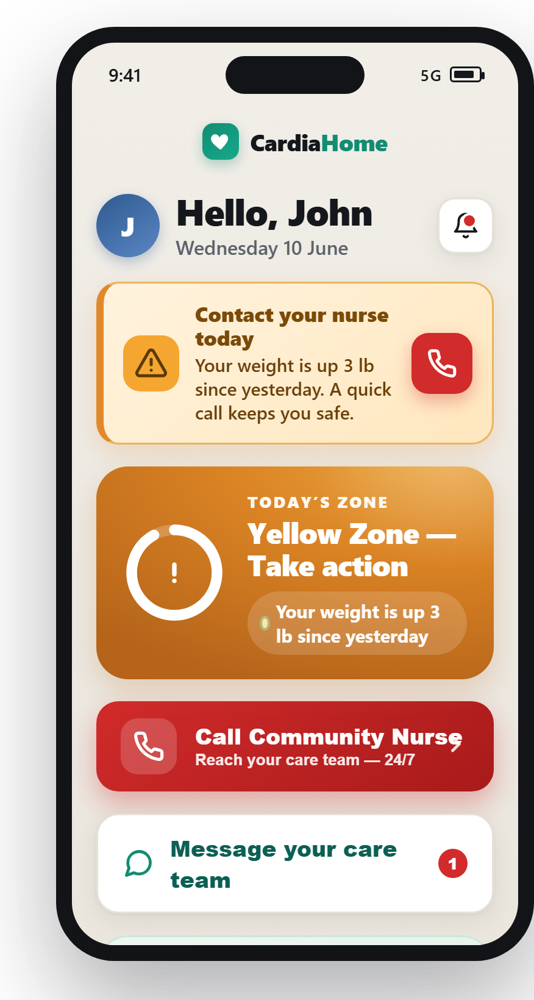

# CardiaHome — Project Status

**A single-file, fully-offline mobile dashboard *concept* for Congestive Heart Failure (CHF) patients, designed elderly-first.**
Opens by double-clicking `index.html` (no backend, no dependencies, no build step).

_Status as of 2026-06-10 · concept / stakeholder demo._

---

## In one line
CardiaHome turns the daily weigh-in, BP, and symptom check into a clinical **Green / Yellow / Red zone** — using standard cardiology thresholds — and connects the patient to their nurse the moment something drifts, to catch heart-failure decline before it becomes a hospital readmission.

> 📣 **Full investor/management pitch lives in [`PITCH.md`](PITCH.md).**

## The opportunity
- **~6.7M U.S. adults** live with heart failure today — projected to **~8.7M by 2030** and **11.4M by 2050**.
- HF costs the U.S. **~$30.7B/year**, projected to **~$69.8B by 2030**.
- **More than 1 in 5** HF patients is **readmitted within 30 days of discharge** — the costliest, most preventable event, and exactly what CardiaHome is built to head off.

_Source: Heart Failure Society of America, HF Stats 2024._

---

## ✅ Built & verified

| Area | What's there |
|---|---|
| **Launch** | Welcome splash → 3-step **onboarding** (name, usual "dry" weight, nurse) with `localStorage` persistence; tap avatar to re-edit |
| **Clinical core** | **Green/Yellow/Red zone engine** — full guideline rule set: ≥3 lb/day, ≥3 lb over 2 days, ≥5 lb/week, or ≥5 lb above baseline → Yellow; ≥5 lb/day → Red; any flagged symptom ≥ Yellow. Driven by a rolling 7-day weight history. |
| **Daily check** | Weight, blood pressure, 3 symptom questions; **red-flag alert** banner with plain-language reasons |
| **Detail screens** | Weight & BP panels — JS-drawn trend charts, reading history, a live **weight stepper**, and 4 **demo scenarios** that each isolate one zone rule (steady / 2-day creep / weekly creep / overnight spike) |
| **Care connection** | Prominent red **Call Community Nurse** + async **chat** (quick-reply chips, keyword-routed nurse replies, typing indicator) |
| **Medication adherence** | Today's doses + weekly **adherence %, streak, and 7-day ring grid** (all update live) |
| **Education & feedback** | Zone-aware **"Today's Tip"** + **"Learn about your heart"** accordion (daily weighing, low-salt, warning signs, meds) |
| **Trust / legal** | Connected-devices status, **safety disclaimer**, and an in-app **clinical reference** |

Every feature was verified with headless-Chrome screenshots.

## 🔍 Quality

- **Audited:** passed a design review (UI/UX) and a security review; all fixes applied.
- **Accessibility (elderly-first):** WCAG-AA contrast, ≥46–64px tap targets, `prefers-reduced-motion`, SVG faces (not emoji), large readable type.
- **Security:** verified fully offline (no external calls, no `eval`); SVG built via DOM API (no `innerHTML` injection sinks); all patient data is fictional and flagged as such.
- **Documented:** `CLAUDE.md` carries the full architecture, behavior, and gotchas.

## 🧪 Clinical grounding

- Zone model + weight thresholds follow **ACC/AHA Heart Failure guidance** and the **Heart Failure "Zones"** patient tool, **cited inside the app**.
- Primary references compiled for clinician review. Thresholds are a **single line in `computeZone()`** — trivially adjustable to match an institution's protocol.

## 🔭 Open / not done

- **Real-user usability testing** with elderly CHF patients (a process, not code — the last roadmap item).
- **Clinician sign-off** on the exact weight cutoffs.
- Remains a **concept/demo** — no real backend, telephony, Bluetooth, or device sync.
- **Productization note:** once the zone engine advises action on real readings it likely becomes **Software as a Medical Device** (FDA Class II / EU MDR Class IIa → HIPAA/GDPR, ISO 13485, clinical evaluation, cybersecurity). The in-app disclaimer holds the line until then.

## Bottom line

Feature-complete as a concept: clinically literate, audited, accessible, documented, and demo-ready. The next moves are **validation** (doctor + real users) and a **productization decision** — not more feature-building.

---

_Created by Dr. Roni Gershonovitch & Dr. Gal Lavie. Concept demo — not a medical device._
